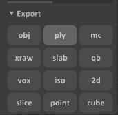
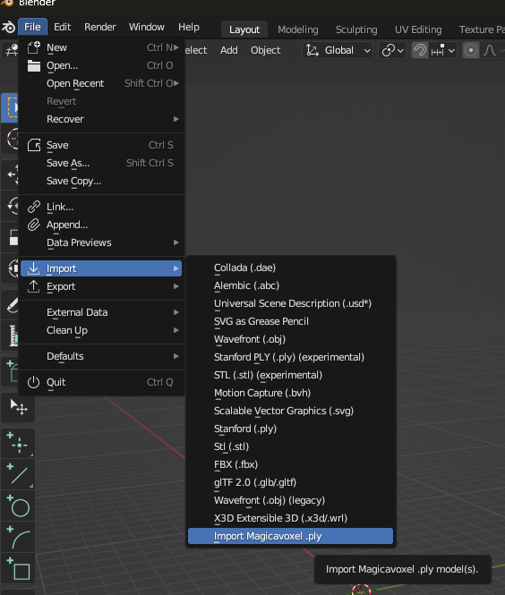
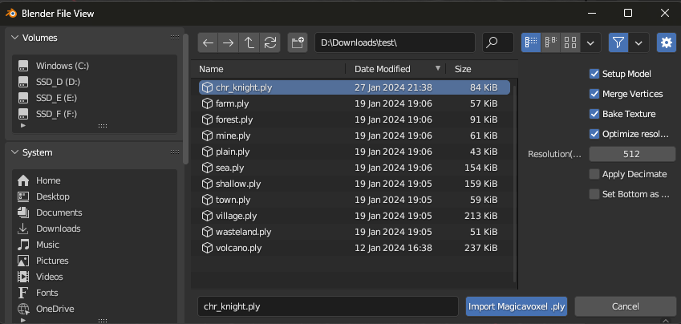
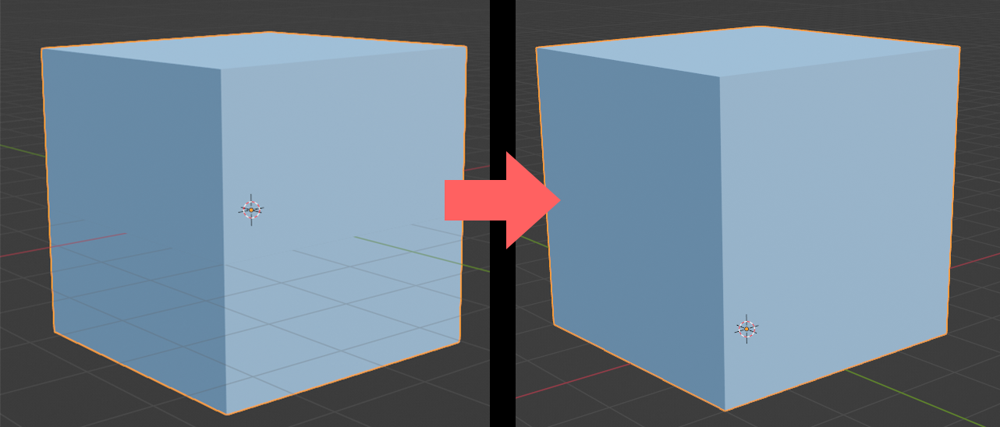

# MagicaPly-Blender

[日本語READMEはこちら。](docs/README_JP.md)

This is an add-on for Blender that facilitates the handling of `.ply` files exported from MagicaVoxel.

Configure settings for voxel models on importing. The loaded model can be used immediately and is suitable for creating game assets.

This add-on includes various features for voxel models. Each feature can be toggled on or off during the import process.

- Automatically setting materials and vertex colors
- Merging duplicate vertices
- UV unwrapping optimized for voxel models
- Texture baking
  - Optimization of texture sizes
- Reduction of vertex count
- Aligning the origin to the base of the model

## Install

### 1. Download plugin

WIP

### 2. Install add-on

Open the Preference from the `Edit` -> `Preferences...` in the top bar.

In the `Add-ons` menu, click on `Install` and select the downloaded zip file.

## Usage

Export the model as `.ply` file in MagicaVoxel.

In the top bar, choose `File` -> `Import` -> `Import Magicavoxel .ply`

Select the file(s) you want to import.

## Features

You can choose features during the import process.Select options according to your needs.

### Setup Model

Automatically create materials and set vertex colors.

### Merge Vertices

Merge duplicated vertices.

### Bake Texture

Optimistically unwrap UVs for voxels, bake vertex colors, and set the texture to materials.

#### Optimize Resolution

Before baking, automatically calculate the optimal texture resolution based on model size.

It is generally recommended to keep this option enabled. When `Bake Texture` is turned off, this option will be ignored.

#### Resolution(Manual)

Specify the texture size manually in baking. When `Optimize Resolution` is turned on、this option will be ignored.

### Apply Decimate

Apply the `Decimate` modifier to reduce the vertex count.

**Always use it together with `Bake Texture`.**。If you apply Decimate while using the existing vertex colors, the texture may become distorted.

### Set Bottom as Origin

Align the origin with the bottom of the model. It can be used for creating game assets.

## Environment

✅: Confirmed  
❓: Unknown  
🚫: Not Supported

| Blender | Windows | MacOS | Linux |
|:--------|:-------:|:-----:|:-----:|
| v3.6    |    ✅    |   ❓   |   ❓   |

## Main Contributor

- [Kokonoe](https://github.com/nonuplet)