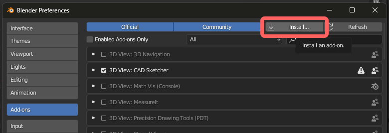
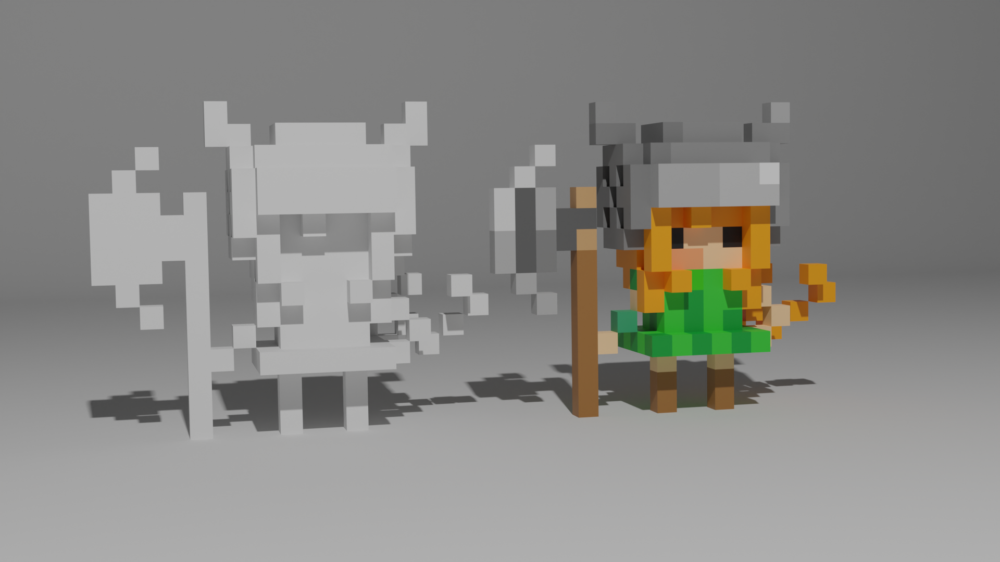
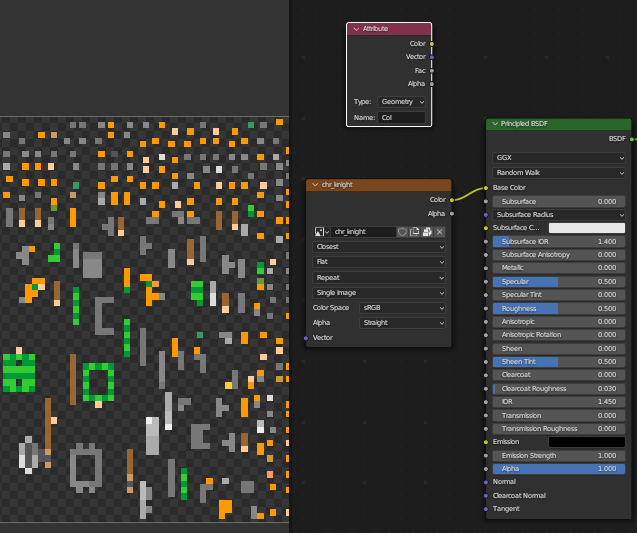
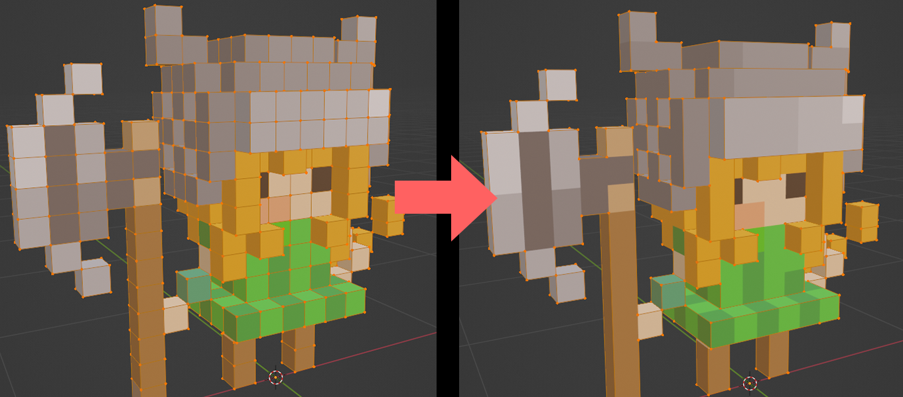

# MagicaPly-Blender

[日本語READMEはこちら。](docs/README_JP.md)

This is an add-on for Blender that facilitates the handling of `.ply` files exported from MagicaVoxel.

Configure settings for voxel models on importing. The loaded model can be used immediately and is suitable for creating game assets.

This add-on includes various features for voxel models. Each feature can be toggled on or off during the import process.

- Automatically setting materials and vertex colors
- Merging duplicate vertices
- UV unwrapping optimized for voxel models
- Texture baking
  - Optimization of texture sizes
- Reduction of vertex count
- Aligning the origin to the base of the model

## Install

### 1. Download plugin

WIP

### 2. Install add-on

Open the Preference from the `Edit` -> `Preferences...` in the top bar.

In the `Add-ons` menu, click on `Install` and select the downloaded zip file.

## Usage

Export the model as `.ply` file in MagicaVoxel.

In the top bar, choose `File` -> `Import` -> `Import Magicavoxel .ply`

読み込みたいファイルを指定します。複数ファイルを同時に選択することも可能です。

## 各機能について

インポート時に各機能を選択できます。用途に合わせてオプションを選択してください。

### Setup Model (モデルのセットアップ)

マテリアルを自動で作成し、頂点カラーをセットしてBlender上で色が表示されるようにします。

### Merge Vertices (頂点のマージ)

重なっている頂点をマージします。

### Bake Texture (テクスチャのベイク)

ボクセルモデルに最適な形でUVを展開、頂点カラーをベイクし、テクスチャをマテリアルにセットします。

#### Optimize Resolution (解像度の最適化)

ベイク前にモデルのサイズに合わせて自動的に最適なテクスチャ解像度を計算します。基本的にONにすることを推奨します。`Bake Texture`
がOFFの時、このオプションは無視されます。

#### Resolution(Manual) (解像度の手動指定)

ベイク時のテクスチャサイズを手動で指定します。`Optimize Resolution` がONになっている時、この値は無視されます。

### Apply Decimate (Decimateモディファイアの適用)

Decimateモディファイアを適用し、頂点数を削減します。

**必ず `Bake Texture` と併用してください**。頂点カラーのままDecimateを行うと、モデルの色がおかしくなってしまいます。

### Set Bottom as Origin (モデルの底面を原点にする)

ボクセルモデルのz座標(高さ)の底面を原点に変更します。ゲームのアセット製作といった場面では有効です。

## 動作状況

プラグインが動作するBlenderのバージョンです。随時更新します。

✅: 動作確認済み  
❓: 不明  
🚫: 非対応

| Blender | Windows | MacOS | Linux |
|:--------|:-------:|:-----:|:-----:|
| v3.6    |    ✅    |   ❓   |   ❓   |

## Main Contributor

- [Kokonoe](https://github.com/nonuplet)