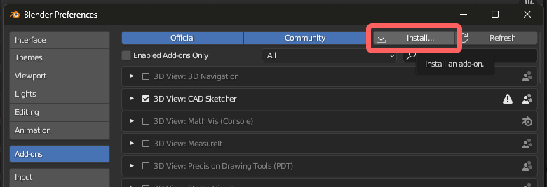
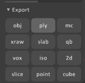
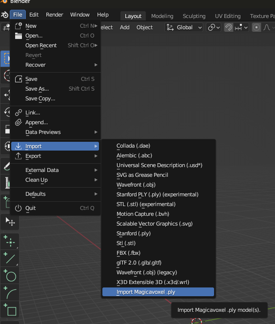
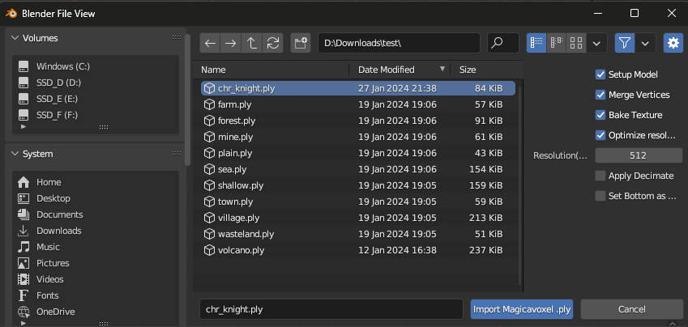
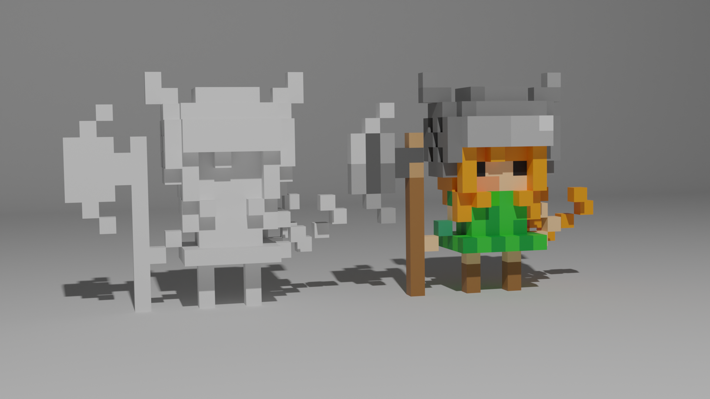
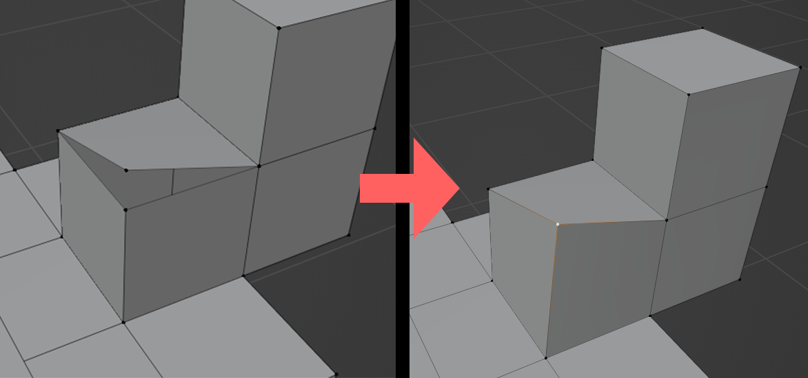
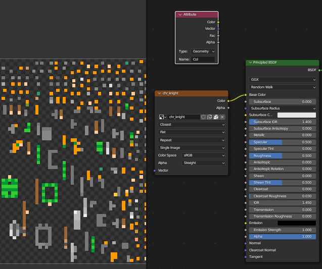
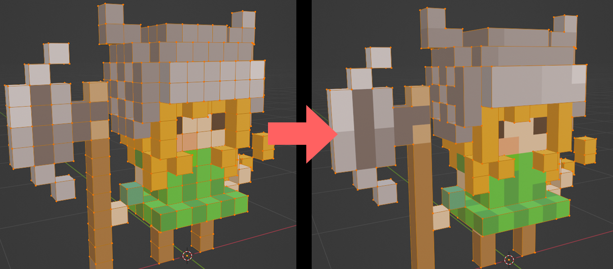
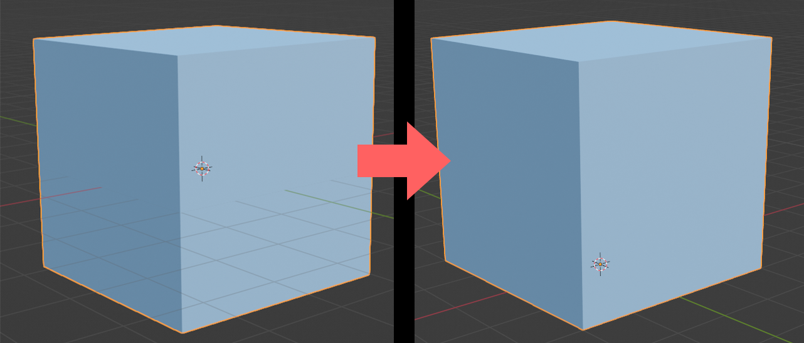

# MagicaPly-Blender

MagicaVoxelで出力した `.ply` ファイルをBlenderで取り扱いやすくするアドオンです。

インポート時にボクセルモデル向けに設定を行います。読み込んだモデルをすぐ使用することができ、ゲームのアセット製作にも向いています。

本アドオンは以下の機能を搭載しています。**各機能はインポート時にON/OFFが指定できます**。

- マテリアルの自動作成・頂点カラーの自動セット
- 重複した頂点をマージ
- ボクセルモデルに最適化したUV展開
- テクスチャのベイク
    - テクスチャサイズの最適化
- 面の最適化・頂点数の削減
- モデルの底辺に原点を合わせる

> [!NOTE]
> 現在のところ日本語環境でも英語が表示されます。
> 次バージョンで日本語表記に対応予定です。

## インストール

通常のBlenderプラグインと同じ手順でインストールできます。

### 1. プラグインをダウンロード

WIP 画像ができたら作る

> [!WARNING]
> ダウンロードしたzipファイルは、**解凍しないで**そのまま使います。

### 2. Blenderにインストール

画面上部の `編集` -> `プリファレンス` で設定画面を開きます。

`アドオン` から右上の `インストール` ボタンをクリックし、ダウンロードしてきたzipファイルを指定します。

## 使い方

Magicavoxelから `.ply` 形式でエクスポートします。

Blenderの画面上部 `ファイル` -> `インポート` -> `Import Magicavoxel .ply` を選択します。

読み込みたいファイルを指定します。複数ファイルを同時に選択することも可能です。

## 各機能について

インポート時に各機能を選択できます。用途に合わせてオプションを選択してください。

### Setup Model (モデルのセットアップ)

マテリアルを自動で作成し、頂点カラーをセットしてBlender上で色が表示されるようにします。

### Merge Vertices (頂点のマージ)

重なっている頂点をマージします。

### Bake Texture (テクスチャのベイク)

ボクセルモデルに最適な形でUVを展開、頂点カラーをベイクし、テクスチャをマテリアルにセットします。

#### Optimize Resolution (解像度の最適化)

ベイク前にモデルのサイズに合わせて自動的に最適なテクスチャ解像度を計算します。基本的にONにすることを推奨します。`Bake Texture`
がOFFの時、このオプションは無視されます。

#### Resolution(Manual) (解像度の手動指定)

ベイク時のテクスチャサイズを手動で指定します。`Optimize Resolution` がONになっている時、この値は無視されます。

### Apply Decimate (Decimateモディファイアの適用)

Decimateモディファイアを適用し、頂点数を削減します。

**必ず `Bake Texture` と併用してください**。頂点カラーのままDecimateを行うと、モデルの色がおかしくなってしまいます。

### Set Bottom as Origin (モデルの底面を原点にする)

ボクセルモデルのz座標(高さ)の底面を原点に変更します。ゲームのアセット製作といった場面では有効です。

## 動作状況

プラグインが動作するBlenderのバージョンです。随時更新します。

✅: 動作確認済み  
❓: 不明  
🚫: 非対応

| Blender | Windows | MacOS | Linux |
|:--------|:-------:|:-----:|:-----:|
| v3.6    |    ✅    |   ❓   |   ❓   |

## Main Contributor

- [Kokonoe](https://github.com/nonuplet)